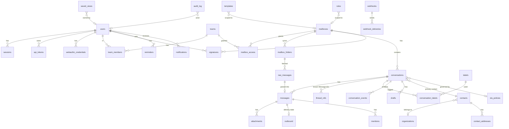

# Echoo data model

Status: proposal, awaiting approval (step 1). Target: PostgreSQL 18 (native `uuidv7()`).

Conventions:
- Primary keys are `uuid DEFAULT uuidv7()` (time-ordered, index-friendly, not guessable).
  Conversations additionally get a human `number bigint` for "#1234" references.
- `timestamptz` everywhere, stored UTC.
- Enums are Postgres `CHECK` constraints on `text`, not `CREATE TYPE`, so adding a value is a
  plain migration without `ALTER TYPE` locking quirks.
- Email addresses are `text` normalized to lower case at the boundary; `citext` is not needed.
- Encrypted columns are `bytea` holding `key_id || nonce || ciphertext`; the AAD binds them to
  `table.column.row_id` so ciphertext cannot be moved between rows.
- `fts` columns are `GENERATED ALWAYS AS (...) STORED` tsvectors.
- Soft delete only where retention/audit requires it (`deleted_at`); otherwise hard delete.

## ERD

## Tables

### Identity and access

**users**
`id, email (unique, lower), name, role CHECK (owner|admin|agent|readonly|custom), custom_role_id NULL, permissions text[], password_hash,
password_changed_at, password_must_change bool, totp_secret_enc bytea NULL, totp_enabled_at,
totp_last_step bigint (replay protection), failed_login_count int, locked_until, last_login_at, avatar_blob_key NULL,
locale DEFAULT 'nl', theme CHECK (system|light|dark), deactivated_at, created_at, updated_at`

Exactly one `owner` enforced by a partial unique index `ON users ((true)) WHERE role='owner'`.
Owner transfer is an explicit, audited action.

Custom roles and SSO (migration 00018): **custom_roles** `id, name (unique, lower), description,
permissions text[], created_at, updated_at`. A user has `role = 'custom'` exactly when
`custom_role_id` is set (CHECK), and `users.permissions` is a copy of the role's list that the
queries changing either side keep in step, so a session loads the effective rights with the user.
It is empty for the built-in roles, whose permissions are presets in `internal/policy`. Deleting a
role that is still in use is refused (`ON DELETE RESTRICT`). **sso_settings** is a single row
(`singleton` primary key) with the OIDC issuer, client id, `client_secret_enc` (keyring, AAD
`sso_settings.client_secret_enc.singleton`), allowed domains, button label, `required`,
`auto_provision` with its default role, and the MFA, email_verified and internal-issuer flags.
`sessions.idp_mfa` marks a session whose second factor came from the identity provider.

Invitations (migration 00012): `users.invited_at` is set from the invitation until it is accepted,
and `deactivated_at` is set for the same period, so every query that hides deactivated users hides
invited ones and they cannot sign in. Accepting clears both. `users.email_notify_mentions` and
`email_notify_assignments` (default false) are the opt-ins for notification email.

**account_tokens**
`id, user_id, purpose CHECK (invitation|password_reset), token_hash bytea unique (sha256 of 32
random bytes), created_by, created_at, expires_at, used_at`. Invitations live 72 hours, resets 30
minutes; a token is consumed with a conditional `UPDATE ... WHERE used_at IS NULL AND expires_at >
now()`. `notifications.email_handled_at` marks rows the notification mail job has decided about.

**sessions**
`id, user_id, token_hash bytea (sha256 of 32 random bytes, unique), csrf_token text, mfa_pending bool,
created_at, last_seen_at, expires_at (absolute, 30 d), idle_expires_at (sliding, 7 d),
ip inet, user_agent text, revoked_at`
Index: `(user_id) WHERE revoked_at IS NULL` for "log out everywhere".

**recovery_codes** `user_id, code_hash bytea (sha256 of an 80-bit code), used_at, PK (user_id, code_hash)`

**webauthn_credentials** (stretch) `id, user_id, credential_id bytea unique, public_key bytea,
sign_count, transports text[], name, created_at, last_used_at`

**api_tokens**
`id, user_id, name, prefix text (first 8 chars, shown in UI), token_hash bytea unique,
scopes text[] ({read} or {read,write}), expires_at NULL, last_used_at, created_at, revoked_at`
Tokens act as their user, never with more rights; the `read` scope narrows further.

**teams** `id, name unique, created_at`
**team_members** `team_id, user_id, PK (team_id, user_id)`
**mailbox_access** `mailbox_id, team_id, level CHECK (read|write), PK (mailbox_id, team_id)`

Access rule: owner/admin see everything. Agents see a mailbox if one of their teams has
`write`; readonly users need `read` or `write` and can never write regardless.
`policy.MailboxScope(user)` returns the set of mailbox IDs, cached per request.

### Mailboxes and raw mail

**mailboxes**
`id, name, email_address unique, display_name, transport CHECK (imap|webhook_postmark|
webhook_mailgun|webhook_ses) DEFAULT 'imap',
auth_type CHECK (password|oauth_google|oauth_microsoft) DEFAULT 'password',
imap_host, imap_port, imap_tls CHECK (implicit|starttls), imap_username, imap_secret_enc bytea,
smtp_host, smtp_port, smtp_tls, smtp_username, smtp_secret_enc bytea,
oauth_token_enc bytea NULL, oauth_expires_at NULL, oauth_connected_at NULL,  -- JSON {access,refresh,expiry}, see docs/mail-oauth.md
inbound_webhook_secret_enc bytea NULL,                         -- phase 2
sent_folder text NULL, mark_seen bool, send_delay_seconds int DEFAULT 5,
default_sla_policy_id NULL, default_team_id NULL,
sync_state CHECK (connected|polling|backoff|auth_failed|disabled), sync_error text,
sync_state_changed_at, created_at, updated_at, disabled_at`

**mailbox_folders**
`id, mailbox_id, name, role CHECK (inbox|sent|other), uidvalidity bigint, last_uid bigint,
highest_modseq bigint NULL, last_synced_at, unique (mailbox_id, name)`

**raw_messages**
`id, mailbox_id, folder_id NULL, source CHECK (imap|webhook|outbound),
uidvalidity bigint NULL, uid bigint NULL, sha256 bytea, size_bytes int, blob_key text,
received_at, parse_status CHECK (pending|parsed|failed|skipped), parse_error text,
created_at`
Unique: `(mailbox_id, folder_id, uidvalidity, uid)` — the IMAP idempotency key.

### Conversations and messages

**conversations**
`id, number bigint (sequence, unique), mailbox_id, subject, subject_normalized,
status CHECK (open|waiting|closed|spam), priority CHECK (none|low|normal|high|urgent),
assignee_user_id NULL, assignee_team_id NULL, contact_id NULL,
snoozed_until NULL, last_message_at, last_inbound_at, last_outbound_at,
sla_policy_id NULL, first_response_due_at, first_responded_at,
resolution_due_at, resolved_at, sla_state CHECK (none|ok|at_risk|breached),
message_count int, has_attachments bool, preview text (first 200 chars of latest message text),
version int (optimistic concurrency), created_at, updated_at, deleted_at, deleted_by NULL`

A conversation with `deleted_at` set is in the trash: every list, count, search, rule and SLA query
filters it out, and it is restored by clearing both columns. Retention (`trash_days`) or a manual
purge deletes it for good. Mail that threads onto a trashed conversation starts a new one.

Indexes (the list screen is the hot path):
- `(mailbox_id, status, last_message_at DESC, id DESC) WHERE deleted_at IS NULL`
- `(assignee_user_id, status, last_message_at DESC, id DESC) WHERE deleted_at IS NULL`
- `(assignee_team_id, status, last_message_at DESC, id DESC)`
- `(snoozed_until) WHERE snoozed_until IS NOT NULL`
- `(resolution_due_at) WHERE status IN ('open','waiting')` and same for `first_response_due_at`
- `(contact_id, last_message_at DESC)`
- trigram GIN on `subject`
- `(mailbox_id, deleted_at DESC, id DESC) WHERE deleted_at IS NOT NULL` (the trash)

**blocked_senders** `id, mailbox_id -> mailboxes ON DELETE CASCADE, pattern (lower-case address or
domain, no @), created_by NULL, created_at`, unique `(mailbox_id, pattern)`. A new conversation whose
sender's address or exact domain matches starts as spam and queues no rules.

**messages**
`id, conversation_id, mailbox_id (denormalized for scoping and uniqueness),
kind CHECK (email|note|system), direction CHECK (in|out) NULL for notes,
raw_message_id NULL, raw_sha256 bytea NULL (copied from raw_messages), message_id_header text, message_id_hash bytea (sha256 of normalized id),
in_reply_to text NULL, references_hdr text[],
from_addr, from_name, to_addrs jsonb, cc_addrs jsonb, bcc_addrs jsonb, reply_to jsonb,
subject, sent_at (Date header), received_at,
body_text text, body_html text NULL (as received, never served unsanitized),
auto_submitted bool, is_bounce bool, spam_score real NULL,
author_user_id NULL (notes and outbound), created_at, deleted_at,
fts tsvector GENERATED (setweight(to_tsvector('echoo_simple', subject),'A') ||
                        to_tsvector('dutch', body_text) || to_tsvector('echoo_simple', body_text))`
Unique: `(mailbox_id, message_id_hash, raw_sha256)` — two different raw
messages that share a Message-ID (broken senders) are both kept; a re-fetched identical copy
is dropped.
Indexes: `(conversation_id, received_at)`, `(mailbox_id, message_id_hash)`, GIN on `fts`.

Bodies live in Postgres (TOAST compresses them); raw `.eml` and attachments live in blob storage.

**thread_refs**
`mailbox_id, message_id_hash, conversation_id, PK (mailbox_id, message_id_hash)`
Every Message-ID we have seen *or* that was referenced in `References`/`In-Reply-To`. This makes
threading a single indexed lookup and handles replies that arrive before their parent.

**attachments**
`id, message_id, filename (sanitized), declared_type, sniffed_type, size_bytes, sha256,
blob_key, content_id NULL (for cid:), disposition CHECK (attachment|inline),
scan_status CHECK (not_scanned|clean|infected|error), scan_detail, created_at`

**outbound**
`message_id PK, idempotency_key uuid unique, status CHECK (queued|sending|retry|sent|failed|
uncertain|bounced|cancelled), scheduled_at, attempt int, last_attempt_at, next_attempt_at,
smtp_response text, error text, dsn_status text NULL, sent_at, created_by, updated_at`
Index: `(status, next_attempt_at)`.

**drafts** `id, conversation_id NULL (new outbound conversation), user_id, mailbox_id,
to/cc/bcc jsonb, subject, body_html, attachment_ids uuid[], updated_at, unique
(conversation_id, user_id)`

**mentions** `message_id, user_id, PK (message_id, user_id)`
**notifications** `id, user_id, kind CHECK (mention|assigned|reply|sla|csat), conversation_id,
message_id NULL, actor_id NULL, created_at, read_at` Index `(user_id, read_at NULLS FIRST, created_at DESC)`.
**uploads** `id, user_id, filename, content_type (sniffed), size_bytes, sha256, blob_key, content_id,
created_at, expires_at (24 h)` — files attached to a reply before it is sent; private to the uploader.
**reply_status_changes** `message_id PK, from_status, to_status` — what a queued reply did to the
conversation status, so undo send can put it back.
**reminders** `id, user_id, conversation_id, remind_at, note, done_at`

**conversation_events** — timeline and reporting source
`id, conversation_id, mailbox_id, actor_user_id NULL, actor_rule_id NULL,
type CHECK (created|status_changed|assigned|unassigned|labeled|unlabeled|priority_changed|
snoozed|woke|merged|first_response|resolved|reopened|sla_breached), data jsonb, created_at`
Index `(mailbox_id, type, created_at)`; BRIN on `created_at` for report ranges.

**labels** `id, name unique, color_token CHECK (one of 8 palette tokens), created_at`
**conversation_labels** `conversation_id, label_id, PK (...)`, index on `label_id`.

**mailbox_counters** `mailbox_id, status, count, PK (mailbox_id, status)` updated in the same
transaction as status changes; gives instant sidebar counts without `COUNT(*)`.

### Contacts

**organizations** `id, name, domains text[], notes (unused), custom_attributes jsonb, created_by,
created_at, updated_at` — GIN on `domains`, trigram on `name`.
**contacts** `id, name, phone, organization_id NULL, notes (unused), custom_attributes jsonb,
created_by, last_activity_at, created_at, updated_at, erased_at (unused)` — trigram on `name`;
`last_activity_at` is kept current by a trigger on `conversations`, so lists sort by it without
joining.
**contact_addresses** `contact_id, email unique, is_primary` — trigram on `email`.
**crm_notes** `id, contact_id XOR organization_id, author_user_id, body, created_at, updated_at`
— notes on a contact or an organization.
**custom_attribute_defs** `id, entity (contact|organization|conversation), key (slug), label, type
(text|number|date|boolean|list|link), options text[]`, unique on `(entity, key)`. Values live in
the `custom_attributes` jsonb column of the entity (also on `conversations`) and are validated
against the definitions by the API and the importer on every write; deleting a definition strips
its key everywhere.
**contact_segments** `id, name, owner_user_id, shared, filter jsonb` — a saved filter (see the
`ContactFilter` schema in the OpenAPI document); `contacts.ResolveSegment` returns the contact ids
a viewer may see, in batches, for campaigns.
**contact_imports** `id, created_by, status, dedupe, delimiter, mapping, source_key, error_key,
counts…` — one CSV import; the uploaded file and the error report are blobs deleted when they are
no longer needed. **data_exports** `id, contact_id, requested_by, status, blob_key, expires_at` — a
GDPR export ZIP, downloadable once. **pending_blob_deletions** `blob_key` — blobs whose references
were dropped; a blob is deleted only when no table refers to it.

Visibility is a SQL function, `contact_visible(contact, user, is_admin, mailbox_ids)`: readable
conversation, or no conversation and created by the user, or admin. `organization_visible` builds on
it. See SECURITY.md, section C.

Free-mail domains (gmail.com, outlook.com, hotmail.com, ziggo.nl, ...) never auto-create an
organization, and an organization cannot be given one as a domain.

GDPR erase: replaces the contact's name and address on messages with a tombstone
(`Gewist contact`, `erased@erased.invalid`); for conversations in which the contact is the only
external party it also blanks subjects and bodies, and deletes attachments, raw `.eml` blobs, drafts
and thread references; it drops the contact rows, notes and earlier exports, and writes an audit
entry with counts. Raw message rows stay (without blob) so IMAP sync does not fetch the mail again.
Export produces a ZIP with `contact.json` and the attachment files.

### Composition helpers

**signatures** `id, user_id NULL, mailbox_id NULL, body_html, CHECK (user_id IS NOT NULL OR
mailbox_id IS NOT NULL)`; resolution: user+mailbox > user > mailbox.
**templates** `id, name, shortcode, scope CHECK (personal|team|mailbox|global), owner_user_id NULL,
team_id NULL, mailbox_id NULL, subject NULL, body_html, created_at, updated_at`
Variables are a fixed allowlist (`{{contact.name}}`, `{{contact.first_name}}`, `{{contact.email}}`,
`{{agent.name}}`, `{{agent.first_name}}`, `{{conversation.number}}`, `{{mailbox.name}}`), substituted
with HTML-escaping; unknown or empty ones stay visible in the message. No template language, no
expressions. The workspace footer of outgoing mail is the `email` row in `settings`.

### Automation

Implemented in migration `00013_automation.sql`; the semantics are in `docs/sla.md`.

**rules** `id, name, mailbox_id NULL, trigger CHECK (conversation_created|message_received|
conversation_updated|sla_at_risk|sla_breached|customer_idle), idle_hours NULL (only customer_idle),
conditions jsonb, actions jsonb, stop_processing bool, position int, enabled bool, created_by,
created_at, updated_at`
Conditions and actions are validated against a closed Go schema on write; unknown keys are
rejected.

**rule_runs** `id, rule_id, conversation_id, trigger, matched bool, actions_applied jsonb, error,
created_at` (retention 30 d) — lets admins see why a rule did or did not fire.

**automation_replies** `rule_id, address, sent_at, PK (rule_id, address)` — claims the one
auto-reply per rule and address per 24 h.

**macros** `id, name, scope CHECK (personal|global), owner_user_id NULL, actions jsonb`

**business_hours** `id, name, timezone, weekly jsonb, holidays date[], is_default` (one default,
partial unique index).

**sla_policies** `id, name, first_response_minutes NULL, resolution_minutes NULL, at_risk_percent
DEFAULT 80, business_hours_id NULL` (NULL counts calendar time).

Added columns: `mailboxes.auto_assign_mode` (off|round_robin|balanced), `default_sla_policy_id`,
`business_hours_id`; `users.max_open`, `availability` (online|busy|offline), `last_auto_assigned_at`;
`messages.is_bulk`; on `conversations` `sla_policy_id, sla_started_at, first_response_due_at,
first_response_met_at, resolution_due_at, sla_state, sla_paused_at, sla_resumed_at,
sla_finalized_at` (a trigger stamps the pause and resume times when the status enters or leaves
waiting).

**saved_views** `id, name (1..60), owner_user_id NULL, team_id NULL, created_by NULL, filters jsonb,
sort CHECK (last_message_desc), position, created_at, updated_at`. Owner set: personal. Owner NULL and
team NULL: shared with everyone. Owner NULL and team set: shared with that team (deleting the team deletes
its views). Names are unique per owner and among shared views, case-insensitively. `filters` follows the
closed schema of `search.Filters` (status, mailbox_ids, label_ids, team_ids, assignee, priorities,
has_attachment, after, before, contact_id, organization_id); unknown fields are rejected on write.

**sender_image_allowlist** `id, mailbox_id NULL, pattern text (address or @domain),
created_by, created_at, unique (mailbox_id, pattern)`

**image_proxy_cache** `url_hash PK (SHA-256 of the remote URL), blob_key, content_type, size_bytes,
fetched_at`. Images fetched through `/render/proxy`; the bytes are in blob storage.

`messages.auth_results text` holds the first `Authentication-Results` header as received, for the
failed-authentication warning.

### Integrations and ops

**webhooks** `id, url, secret_enc bytea, events text[], include_content, allow_http, enabled,
disabled_reason, consecutive_failures, created_by, created_at, updated_at` (auto-disabled after
50 consecutive failures; `allow_http` can only be set by the owner).
**webhook_events** `id bigint, type, mailbox_id, conversation_id, message_id, contact_id,
occurred_at, fanned_out_at` is the outbox. `webhooks.Record` writes to it in the transaction of
the change it describes (only when an enabled webhook subscribes to the type); the
`webhook.fanout` job turns pending rows into deliveries. IDs only, no content.
**webhook_deliveries** `id, webhook_id, event_id, event, payload_hash, status
(pending|retrying|succeeded|failed), status_code, error (a code), duration_ms, attempt,
created_at, updated_at` (retention 14 d; one row per delivery, holding the latest attempt).

**audit_log** `id bigint identity, at, actor_user_id NULL, actor_token_id NULL, actor_ip inet,
action text, target_type, target_id, metadata jsonb`
Append-only: a trigger raises on `UPDATE`/`DELETE`/`TRUNCATE`. The one exception is the
`SECURITY DEFINER` function `audit_log_purge(older_than interval, batch_limit integer)`, owned by
the schema owner: it refuses ages under 60 days, writes an `audit.purged` entry with the count
of the batch in the same transaction, and only then deletes it, with a transaction-local flag
that the trigger accepts only when `current_user` is the table owner. The application role
(`echoo_app`) owns nothing, can only `EXECUTE` the function, and cannot delete rows itself.

**push_devices** `id, user_id, session_id NULL (ON DELETE SET NULL), kind (webpush|apns|fcm), endpoint
(push service URL or device token), p256dh, auth (Web Push keys), label, created_at, last_push_at`,
unique `(kind, endpoint)`. Revoking a session deletes its devices (trigger); an expired session keeps
them. **push_vapid** is a single row with the Web Push key pair, the private key encrypted with the
keyring. **notifications.push_handled_at** is set when the dispatcher claims a row, pushed or not;
rows older than 30 minutes are not pushed.

**settings** `key text PK, value jsonb, updated_by, updated_at` (retention periods, remote-image
default, max attachment size overrides, business name).

The `retention` row of `settings` holds the workspace retention periods,
`{"global": {"closed_conversation_months": null, "attachment_months": null, "spam_days": null,
"trash_days": 30}, "audit_months": 12}`; `null` keeps that kind of data forever, and a workspace
without the row uses these defaults (a stored value without `trash_days` gets 30 too). `retention_last_run` holds the counts of the last daily purge.
**retention_policies** `mailbox_id PK -> mailboxes ON DELETE CASCADE, closed_conversation_months,
attachment_months, spam_days, trash_days (each NULL or in range), updated_by, updated_at`: a mailbox with a
row overrides the workspace periods as a whole (NULL there keeps forever).

The `reports` row of `settings` holds `{"timezone": "Europe/Amsterdam"}`, the timezone that cuts days in reports.

**csat_settings** `mailbox_id PK, enabled, delay_hours CHECK 0..24, enabled_at, updated_at`. A mailbox
without a row has surveys off. `enabled_at` restarts each time the survey is switched on.
**csat_requests** `conversation_id PK, mailbox_id, token_hash UNIQUE, message_id, sent_at, expires_at,
skipped_reason, created_at`. One row per conversation, claimed before the mail is queued; `sent_at` is
NULL when the survey was skipped (`skipped_reason` says why).
**csat_responses** `conversation_id PK -> csat_requests, mailbox_id, rating CHECK 1..5, comment
(<= 2000), token_hash, created_at, updated_at`. Changeable for 7 days after `created_at`.

**campaigns** `id, name, mailbox_id, segment_id NULL (ON DELETE SET NULL), segment_name, subject, body_html,
status CHECK (draft|scheduled|sending|paused|done|cancelled), scheduled_at, rate_per_minute CHECK 1..1000,
created_by NULL, started_by NULL, materialized_at, started_at, finished_at, error, created_at, updated_at`. `error` is a code
(`segment_missing`, `creator_unavailable`, `mailbox_unavailable`). `body_html` is sanitized on save.
**campaign_recipients** `id, campaign_id -> campaigns CASCADE, contact_id NULL (SET NULL), email, name, state
CHECK (pending|queued|sent|failed|skipped), skip_reason CHECK (unsubscribed|no_address|duplicate|bounced|cancelled),
message_id NULL, conversation_id NULL, error, unsubscribe_secret, queued_at, finished_at, created_at`,
UNIQUE (campaign_id, contact_id). `email` and `name` are snapshots, blanked when the contact is erased.
`unsubscribe_secret` keys the HMAC of the recipient's unsubscribe link, so rotating the encryption keys
does not break old links. **outbound.extra_headers** is a JSON array of `{name, value}` for
`List-Unsubscribe`, `List-Unsubscribe-Post` and `Precedence`.

**River tables** are created by River's own migrator, invoked from `echoo migrate`.

### Phase 2 placeholders (columns only, no code)
- `mailboxes.transport`, `inbound_webhook_secret_enc`.
- `messages.kind` can gain `form` (contact form) without schema change beyond the CHECK.
- AI suggestions: no tables now; would store suggestions in a separate table and never in
  `messages`.
- Knowledge base: separate tables later; no foreign keys from core tables required.

## Migrations (outline)

Goose, SQL files, embedded in the binary. Each migration runs in a transaction unless marked
`-- +goose NO TRANSACTION` (only for `CREATE INDEX CONCURRENTLY` later).

| File | Contents |
|---|---|
| `00001_identity.sql` | users, recovery_codes, sessions, teams, team_members, settings (phase 1, done). |
| `00002_audit.sql` | audit_log + append-only trigger (phase 1, done; purge function in phase 7). |
| `00003_extensions.sql` | `pg_trgm`, `unaccent`; custom text search config `echoo_simple` = simple + unaccent. |
| `00004_mailboxes.sql` | mailboxes, mailbox_folders, mailbox_access. |
| `00005_contacts.sql` | organizations, contacts, contact_addresses. |
| `00006_conversations.sql` | conversations (+ number sequence), labels, conversation_labels, mailbox_counters, conversation_events. |
| `00007_messages.sql` | raw_messages, messages (+ fts), thread_refs, attachments, outbound, drafts. |
| `00008_collab.sql` | mentions, notifications, reminders, signatures, templates, saved_views. |
| `00009_automation.sql` | sla_policies, rules, rule_runs, sender_image_allowlist. |
| `00011_platform.sql` | api_tokens, webhooks, webhook_events, webhook_deliveries, audit_log indexes for the viewer. |
| `00014_search_views.sql` | `saved_views` (created here, not in `00008`), `messages_received_at` and `messages_from_addr_trgm` indexes for search. |
| `00015_contacts.sql` | CRM: contact phone, custom attributes, `crm_notes`, `custom_attribute_defs`, `contact_segments`, `contact_imports`, `data_exports`, `pending_blob_deletions`, visibility functions, activity trigger. |
| `00016_reports_csat.sql` | Report indexes (`conversations_report_created`, `conversations_report_resolved`, `messages_report_in`, `messages_report_out`), `csat_settings`, `csat_requests`, `csat_responses`, notification kind `csat`. |
| `00020_campaigns.sql` | `contacts.unsubscribed_at`, `contact_addresses.bounced_at`, `outbound.extra_headers`, `campaigns`, `campaign_recipients`. |
| `00022_campaign_started_by.sql` | `campaigns.started_by`: recipients are resolved with the visibility of the user who starts a campaign. |
| `00024_push.sql` | `push_devices` (+ trigger that drops a revoked session's devices), `push_vapid`, `users.push_notify_*`, `notifications.push_handled_at`. |
| `00023_trash_blocklist.sql` | `conversations.deleted_by` and the trash index, `retention_policies.trash_days` (30 for existing rows), `blocked_senders`. |
| `00019_operations.sql` | `retention_policies`; `audit_log_append_only()` with the purge exception; `audit_log_purge()` (`SECURITY DEFINER`, `EXECUTE` for `echoo_app` only). |
| `river` | River's migrations, applied by `rivermigrate` in the same `echoo migrate` run. |

Migrations are forward-only in production. Each has a `-- +goose Down` for development use,
but releases never rely on down migrations.
